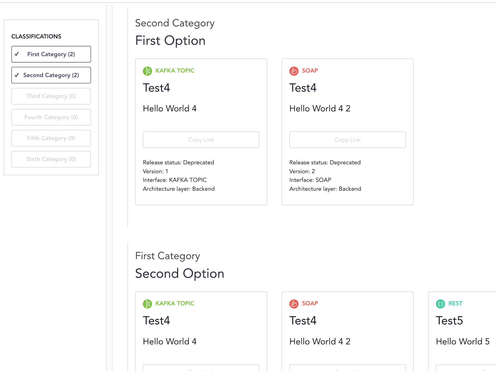

Apimap.io Portal
===

🎉 **Welcome** 🎉

This is the home of the Apimap.io project, a freestanding solution to keep track of all functionality a company
provides through an API. It is a push based system, connected with your build pipeline or manually updated using our CLI.

> **Application programming interface (API)**: Point of functional integration between two or more systems connected
> through commonly known standards

**Why is this project useful?** Lost track of all the API functionality provided inside your organization? Don't want
to be tied to an API proxy or management solution? The Apimap.io project uploads, indexes and enables discoverability of all
your organizations APIs. We care about the source code, removing the limitation of where the API is hosted and how your
network is constructed.

### Telenor Open Source Project
This project is a part of the Open Source initiatives in Telenor. Read more about our company at http://www.telenor.com

## Table of Contents

* [Project Components](#project-components)
* [Run](#run)
* [Contributing](#contributing)
* [Screenshots](#screenshots)

I want to know more of the technical details and implementation guides: [DEVELOPER.md](DEVELOPER.md)

## Project Components
___
This is a complete software solution consisting of a collection of freestanding components. Use only the components you
find useful, create the rest to custom fit your organization.

- A **Developer Portal** with wizards and implementation information
- A **Discovery Portal** to display APIs and filter search results
- An **API** to accommodate all the information
- A **Jenkins plugin** to automate information parsing and upload
- A **CLI** to enable manual information uploads

## Run
___

We primarily recommend the following two ways of running the applications:
- Locally using npm
- From our published Docker image

### Locally using npm

Based on Vue, all the usual targets exist. The easiest way to get started is using **start**

> npm run build
> npm run start

#### From our published Docker image

It is possible to use the image "as-is", with a customized metadata-options.json and search-options.json file.

> docker run -e APIMAP_API_URL="http://localhost" -e APIMAP_DEVELOPER_URL="http://localhost" -e APIMAP_TITLE="Apimap.io" -e APIMAP_SUPPORT="Visit github for support" -p 8080:8080 apimap/portal

#### Requirements`

A custom metadata-options.json file is required to have content. This must match the file used in the Portal service.

#### Configuring the Docker Image

We love "build once deploy anywhere" and all configuration is done using environment variables and file mounting.

You can find our default configuration in the Dockerfile file, and we recommend that you override using environment variables.

## Contributing
___

Read [howto contribute](CONTRIBUTING.md) to this project.

## Screenshots
___

### Startpage

### Search results

